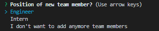

## Team Contact Generator

In this activity, I used node.js to create a team contact creator. The objective of this activity was to simiplify the creation of teams. It allows users to create a team website that has of the teams information available at their disposal.

To start: the questions prompt you to create a manager with a series of questions that are necessary for contact.

Now you start to build your team! You will be prompted a list to select between an Engineer or Intern. Additionally, you can answer with not adding anymore employees. 

You can add a team member (intern/engineer) and answering the following questions:

Once your team is created you will receive a newly created HTML:

I am open to any adjustments, please feel free to access through my github account jdefranco24. Enjoy!
